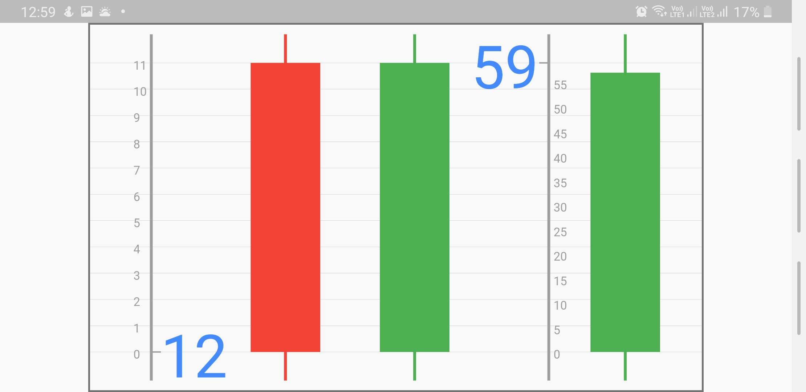
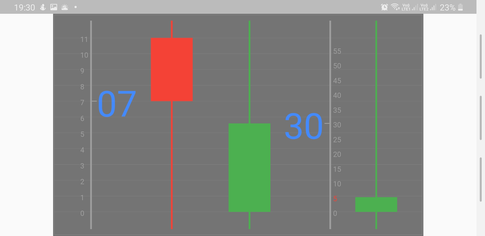

# Candlestick Clock

Welcome to Candlestick Clock designed using FLUTTER SDK!

Example [Candlestick Clock](At Morning)

Example [Candlestick Clock](At Afternoon)

Example [Candlestick Clock](At Evening)

Example [Candlestick Clock](At Night)

